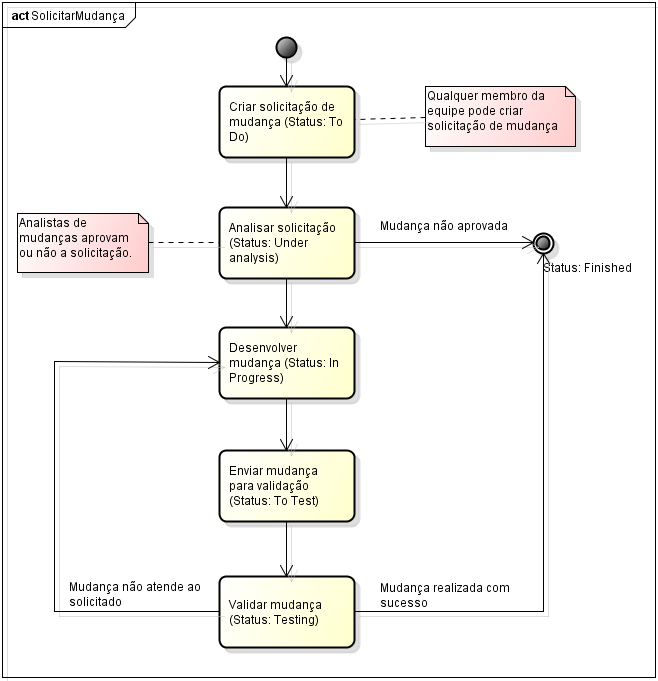

#Diagnósticos Lite#

#Plano de Gerenciamento de Configuração#

#LITE_PGC_1.1#

# Histórico de Versões

<table>
  <tr>
    <td><b>Data</td>
    <td><b>Versão</td>
    <td><b>Descrição</td>
    <td><b>Autor</td>
  </tr>
  <tr>
    <td>08/12/2014</td>
    <td>V.1.0</td>
    <td>Criação do documento</td>
    <td>Elsa Martins</td>
  </tr>
  <tr>
    <td>12/12/2014</td>
    <td>V.1.1</td>
    <td>Edição dos itens 1, 3 e 5</td>
    <td>Ariadyne Dantas</td>
  </tr>
</table>

# 1. Introdução

Esse documento tem por finalidade planejar a execução do processo de Gerencia de Configuração do projeto "Diagnósticos Lite", estabelecendo normas e ferramentas que permitam gerenciar de maneira satisfatória os itens de configuração do sistema.

## 1.1 Finalidade

A finalidade deste documento é criar um padrão a ser seguido por todos os membros da equipe com o intuito de garantir um maior controle do produto no decorrer do projeto. 
Para que isso aconteça serão detalhados os recursos necessários (equipes, ferramentas e computadores), as responsabilidades atribuídas e o cronograma de atividades.

## 1.2 Escopo

Este plano deverá ser seguido pela gerência de configuração durante todo o ciclo de vida e abrangerá todos os dados relevantes definidos nos projetos relacionados ao sistema, incluindo os produtos de trabalho definidos conforme os processos de software, as ferramentas utilizadas para o desenvolvimento do software e os produtos que serão liberados para os clientes.

## 1.3 Definições, Acrônimos e Abreviações

<table>
  <tr>
    <td><b>Termo</td>
    <td><b>Significado</td>
  </tr>
  <tr>
    <td>GC</td>
    <td>Gerência de Configuração</td>
  </tr>
  <tr>
    <td>Baselines</td>
    <td>Conjunto de itens de configuração que conseguiram um estado comprovado de estabilidade.</td>
  </tr>
  <tr>
    <td>CCB</td>
    <td>Comitê para o Controle de Mudanças.</td>
  </tr>
  <tr>
    <td>COTS</td>
    <td>Componentes de hardware e software comerciais de "prateleira"</td>
  </tr>
  <tr>
    <td>Change Request</td>
    <td>Qualquer pedido feito para alterar um produto de trabalho</td>
  </tr>
</table>

## 1.4 Visão Geral

<table>
  <tr>
    <td><b>Seção</td>
    <td><b>Descrição</td>
  </tr>
  <tr>
    <td>2</td>
    <td>Descreve os papeis e responsabilidades da gerência de configuração, ferramentas utilizadas, ambiente e infraestrutura
</td>
  </tr>
  <tr>
    <td>3</td>
    <td>É apresenta o plano de configuração onde é definido como serão identificados os itens configuráveis, como será o agrupamento desses itens, as configurações bases do projeto, a estrutura do repositório e o controle de acesso.
</td>
  </tr>
  <tr>
    <td>4</td>
    <td>Define como serão feitas as requisições à GC, padronizando um processo a ser seguido.
</td>
  </tr>
  <tr>
    <td>5</td>
    <td>Define quais os treinamentos e recursos necessários para implantação da GC.
</td>
  </tr>
  <tr>
    <td>6</td>
    <td>Apresenta o cronograma das auditorias de configuração e o que será verificado.
</td>
  </tr>
</table>

# 2. Gerenciamento de Configuração de Software

## 2.1 Organização, Responsabilidades e Interfaces

### 2.2.1 Organização
<table>
  <tr>
    <td><b>Papéis</td>
    <td><b>Equipe</td>
    <td><b>Responsabilidade</td>
  </tr>
  <tr>
    <td>Gerente de Configuração</td>
    <td>Elsa Martins</td>
    <td>Estabelecer Políticas de GC 
Escrever Plano de GC 
Configurar Ambiente de GC 
Criar Espaços de Trabalho de Integração 
Criar Baselines 
Promover Baselines</td>
  </tr>
  <tr>
    <td>CCM</td>
    <td>Ariadyne Dantas</td>
    <td>Estabelecer Processo de Controle de Mudanças 
Revisar Solicitação de Mudança</td>
  </tr>
  <tr>
    <td>Desenvolvedor</td>
    <td>Elsa Martins</td>
    <td>Seguir os padrões e procedimentos definidos no Plano de Gerência de Configuração</td>
  </tr>
  <tr>
    <td>Solicitantes</td>
    <td>Ariadyne Dantas</td>
    <td>Enviar Solicitação de Mudança 
Atualizar Solicitação de Mudança</td>
  </tr>
</table>

## 2.2 Ferramentas, Ambiente e Infraestrutura

### 2.1.1 Ferramentas utilizadas para gerência de configuração

<table>
  <tr>
    <td><b>Software</td>
    <td><b>Propósito</td>
    <td><b>Ambiente</td>
    <td><b>Release/Versão</td>
  </tr>
  <tr>
    <td>Git</td>
    <td>Controle de Repositório</td>
    <td>Desenvolvimento. Ambiente configurado em servidor interno.
Capacidade máxima de armazenamento: 1Tb</td>
    <td></td>
  </tr>
  <tr>
    <td>TortoiseGIT</td>
    <td>Acesso ao repositório </td>
    <td>Desenvolvimento.
Acessa o repositório local.</td>
    <td>1.8.12.0</td>
  </tr>
</table>

### 2.1.2 Ferramentas do ambiente de desenvolvimento

<table>
  <tr>
    <td><b>Software</td>
    <td><b>Propósito</td>
    <td><b>Ambiente</td>
    <td><b>Release/Versão</td>
  </tr>
  <tr>
    <td>Sistema Operacional</td>
    <td>Windows 7 x64/ Ubuntu 12.10</td>
    <td>Desenvolvimento</td>
    <td></td>
  </tr>
  <tr>
    <td>Máquinas Virtuais</td>
    <td>VMWare Player</td>
    <td></td>
    <td>6.0.2</td>
  </tr>
  <tr>
    <td>MS-Office</td>
    <td>Documentos do Word</td>
    <td>Todos</td>
    <td>2013</td>
  </tr>
  <tr>
    <td>MS-Project</td>
    <td>Edição do cronograma</td>
    <td>Desenvolvimento</td>
    <td>2010</td>
  </tr>
  <tr>
    <td>Qt </td>
    <td>Desenvolvimento C++</td>
    <td>Desenvolvimento</td>
    <td>4.7.4</td>
  </tr>
  <tr>
    <td>Visual Studio</td>
    <td>Desenvolvimento C++</td>
    <td>Desenvolvimento</td>
    <td>2010</td>
  </tr>
  <tr>
    <td>Enterprise Architect</td>
    <td>Modelagem de diagramas de dados</td>
    <td>Todos</td>
    <td>8.0.863</td>
  </tr>
  <tr>
    <td>JIRA</td>
    <td>Controle de atividades e documentação de TS, REQ e Testes</td>
    <td>Todos</td>
    <td>6.4</td>
  </tr>
</table>

### 2.1.3 Estrutura do Ambiente

<table>
  <tr>
    <td><b>Ambiente</td>
    <td><b>Descrição</td>
    <td><b>Transição</td>
  </tr>
  <tr>
    <td>Desenvolvimento</td>
    <td>Ambiente que servirá para desenvolvimento da aplicação</td>
    <td>Uma "feature" será considerada finalizada quando todo o requisito for implementado e validado através de testes unitários e revisão de código.</td>
  </tr>
  <tr>
    <td>Integração</td>
    <td>Ambiente em que serão realizados os testes de integração</td>
    <td>Quando uma ou mais “features” estão implementadas e com um nível satisfatório de integração. </td>
  </tr>
  <tr>
    <td>Release</td>
    <td>Ambiente em que as versões serão geradas</td>
    <td>Quando uma ou mais “features” planejadas estão integradas e prontas para validação.</td>
  </tr>
</table>

# 3. O Programa de Gerenciamento de Configuração

## 3.1 Identificação da Configuração

### 3.1.1 Métodos de Identificação

•	Os artefatos do projeto deverão seguir a seguinte estrutura: 
(NomeDoProjeto)_ (NomeDoArtefato)_(revisão) 

•	Os commits deverão seguir a seguinte estrutura: 
Para tasks: 
(código da subtask) #comment (breve descrição do código desenvolvido) 
(código da subtask) #resolved (breve descrição do código desenvolvido) 

Para bugs: 
(código do bug) #comment (breve descrição de modificações relacionadas ao bug) 
(código do bug encerrado) #resolved (breve descrição da solução realizada para resolver o bug) 

•	As branches do projeto deverão seguir a seguinte estrutura: 
(NomeDoProjeto)_ (módulo)_(revisão) 

•	As Tags do projeto deverão seguir a seguinte estrutura: 
(NomeDoProjeto)_ (NomenclaturaOficial)_(RevisãoAtualDoGIT) 

•	A nomeclatura das versões oficiais deverão seguir a seguinte estrutura: 
(nº base).<nº da biblioteca>.<correções de bugs> 

Onde: 
Base: Indica grandes alterações na arquitetura; 
Bibliotecas: Este dígito representa alterações nos componentes (bibliotecas, .dll); 
Correções de bugs: Indica correções realizadas para resolver bugs encontrados na versão corrente; 

### 3.1.2 Itens de Configuração

<table>
  <tr>
    <td><b>Item (ou Tipo de Item)</td>
    <td><b>Responsável na equipe</td>
    <td><b>Inclusão em Baseline</td>
  </tr>
  <tr>
    <td>Cronograma do projeto</td>
    <td>Gerente de projetos</td>
    <td>Quando criado o documento e quando é feito alguma alteração no documento sendo previamente acordado com o cliente</td>
  </tr>
  <tr>
    <td>Documento de requisitos do projeto</td>
    <td>Analista de requisitos</td>
    <td>Quando criado o documento e quando solicitado uma mudança nos requisitos e o mesmo for devidamente identificado, estimado e validado, gerando assim uma nova versão do documento.</td>
  </tr>
  <tr>
    <td>Especificação de caso de uso</td>
    <td>Analista de sistemas</td>
    <td>Quando criado o documento e quando houver alguma alteração tendo sido validada pelo cliente gerando assim uma nova versão do documento.</td>
  </tr>
  <tr>
    <td>Caso de teste</td>
    <td>Analista de teste</td>
    <td>Quando criado o documento e quando houver alguma alteração tendo sido validada pelo cliente gerando assim uma nova versão do documento.</td>
  </tr>
  <tr>
    <td>Script de testes</td>
    <td>Analista de teste</td>
    <td>Quando o documento é criado e quando há uma alteração no escopo do projeto previamente validada pelo cliente. </td>
  </tr>
  <tr>
    <td>Plano de teste</td>
    <td>Analista de teste</td>
    <td>Quando criado o documento e quando houver alguma alteração tendo sido validada pelo cliente gerando assim uma nova versão do documento.</td>
  </tr>
  <tr>
    <td>Plano de gerenciamento de configuração</td>
    <td>Gerente de configuração </td>
    <td>Quando criado o documento e quando houver alguma alteração tendo sido validada pelo cliente gerando assim uma nova versão do documento.</td>
  </tr>
</table>

### 3.1.3 Baselines do Projeto

Baselines de projeto 
•	O gerente de configuração autoriza a geração da baselines do projeto, porém quem repassa a ele a necessidade da geração é o analista de sistemas.
•	Gerada a cada marco definido no cronograma.

Baselines de produto	
•	O gerente de configuração autoriza a geração da baselines do produto, porém quem repassa a ele a necessidade da geração é o analista de sistemas.
•	Gerada no final de cada iteração
  
## 3.2 Controle de Configuração e Mudança

### 3.2.1 Processamento e Aprovação de Solicitações de Mudança

As solicitações de mudanças nas "Baselines" devem ser registradas na ferramenta JIRA, no projeto “Change Request”, obedecendo o seguinte fluxo:

### 3.2.2 Comitê de Controle de Mudança (CCB)

<table>
  <tr>
    <td><b>Responsáveis:</td>
    <td><b>Funções:</td>
  </tr>
  <tr>
    <td>Analista de Sistemas</td>
    <td>Recebe solicitação de mudança e realiza estudo do impacto da realização da mudança.</td>
  </tr>
  <tr>
    <td>Gerente de Projetos</td>
    <td>Analisa a viabilidade da implementação com base no estudo de impacto. Responsável por planejar a realização da mudança e estimar os prazos.</td>
  </tr>
  <tr>
    <td>Gerente de Configuração</td>
    <td>Verifica o que será necessário para integrar a mudança, garantindo integridade do que não foi alterado</td>
  </tr>
</table>

# 4. Padrões e Procedimentos

## 4.1 Padrão de Estrutura de Pastas 

Se em algum determinado momento do projeto a estrutura de pastas não atender as necessidades, será gerada uma adaptação e esta deverá ser descrita no Plano de Projeto.

A estrutura do repositório é composta na seguinte estrutura:

Git 
+-branches 
|  +-Lite 4.1.0_VideoCard 
    |  +-Acompanhamento e Controle 
    |  +-Construção 
    |  |  +-Análise 
    |  |  +-Implementação 
    |  |  +-Revisão de Código 
    |  |  +-Testes 
   |  +-Planejamento e Elaboração 
    |  |  +-Especificação Técnica 
    |  |  +-Requisitos 
    |  |  +-Planejamento de Teste 
    |  |  +-Planejamento de Desenvolvimento 
+-tags 
 |  +-(IDVersão)_(IDCommit) 
    |  +-Lite 4.0.0 
+-master 
 |  +-Lite 4.1.0 
    |  +-Acompanhamento e Controle 
    |  +-Construção 
    |  |  +-Análise 
    |  |  +-Implementação 
    |  |  +-Revisão de Código 
    |  |  +-Testes 
    |  +-Planejamento e Elaboração 
    |  |  +-Especificação Técnica 
    |  |  +-Requisitos 
    |  |  +-Planejamento de Teste 
    |  |  +-Planejamento de Desenvolvimento 

A movimentação dos arquivos nas diferentes pastas ficará a cargo do Gerente de Configuração.

# 5. Treinamento e Recursos

* As ferramentas utilizadas para no processo de desenvolvimento serão:

    * VMWare Player

    * MS-Office

    * MS-Project

    * Qt

    * Visual Studio

    * Enterprise Architect

    * JIRA

    * Git

    * TortoiseGit

* A equipe de desenvolvimento terá treinamento nas ferramentas necessárias para o desenvolvimento do sistema, como: VMWare Player, Visual Studio e Qt.

* A equipe de Analistas terá treinamento nas ferramentas necessárias para a criação dos casos de uso e casos de teste, como: Enterprise Architect.

* O gerente de projetos terá um curso aprofundado na ferramenta MS-Project

* Toda a equipe, inclusive a equipe de gestão de configuração, fará treinamento nas ferramentas: JIRA, Ms-Office, Git e TortoiseGit.

* As equipes individualmente deverão promover workshops para nivelamento do conhecimento entre eles

# 6. Auditorias de Configuração

O cronograma de verificações de Gestão de Configuração deve ser planejado na Ferramenta de Gestão de Projetos – MS Project. Este cronograma será elaborado a cada Release (ciclo de vida até a entrega para o cliente) e conterá todas as atividades de GC do projeto. Elas podem ainda, estar planejadas no Gmail, para facilitar a integração com o calendário das pessoas que serão diretamente afetadas.
Se, durante as audições, forem detectadas falhas na Gestão de Configuração, o auditor responsável deverá criar uma requisição de mudança no projeto "Auditoria", que se encontra na ferramenta JIRA e segue o mesmo modelo de aprovação de uma solicitação de mudança de “baseline” (seção *3.2.1 Processamento e Aprovação de Solicitações de Mudança*), atribuindo esta requisição ao Gerente de Configuração, que irá avaliar se será realizada ou não a mudança.
